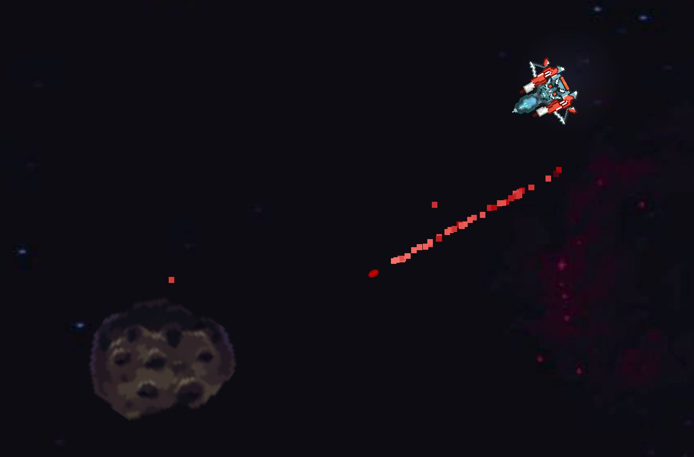
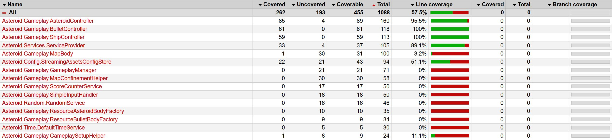

# Asteroids

This is a simplified remake of the classic [Asteroids](https://en.wikipedia.org/wiki/Asteroids_(video_game)) game in Unity made for a coding assignment.

**One ship, lots of asteroids, go pew pew!**

### Features
* The classic asteroid game
* Simple but charming pixel art
* Locally persisted high score

## Implementation

Motivations

* Separation of game logic and unity api
* Separation of part by responsibility
* Performance (not overly optimized but does not wastes resources)
* Easy to extend
* Easy to configure
* Testability

### Dependency injection

Custom and easy to use DI system for better flexibility and testability

### Wrapped system/unity services

* System.Random and Unity Time are wrapped as injectable services, to make them easy to replace for testing

### Input

Implementation for both the old and the new input system
* Controller support 

### Persistance

* StreamingAssets configuration file
* Persisted high score values

### Test Coverage

The important game logic classes and utility services have pretty good code coverage.

## Known issues

* No sound (work in progress)
* Some UX issues in the menus
* Some particle effect bugs